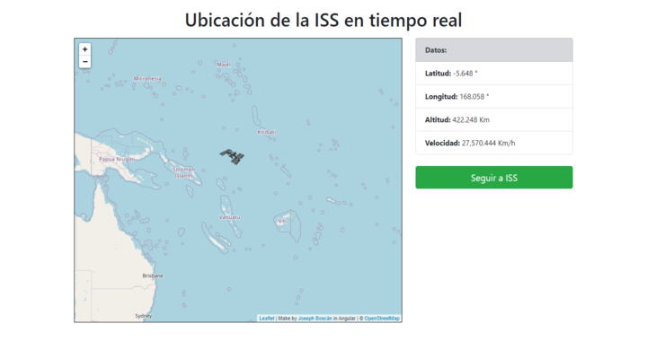

# Tracker Map ISS in Realtime

This project show the `Internacional Space Station` in realtime using Angular and [Leaflet JS](https://leafletjs.com/) from the API [https://api.wheretheiss.at](https://api.wheretheiss.at/v1/satellites/25544), the project make a request every second to get the data and show it in the map.

## Demo

- [Project Demo](https://joeypy.github.io/TrackerMapISS/)

## Screenshot

